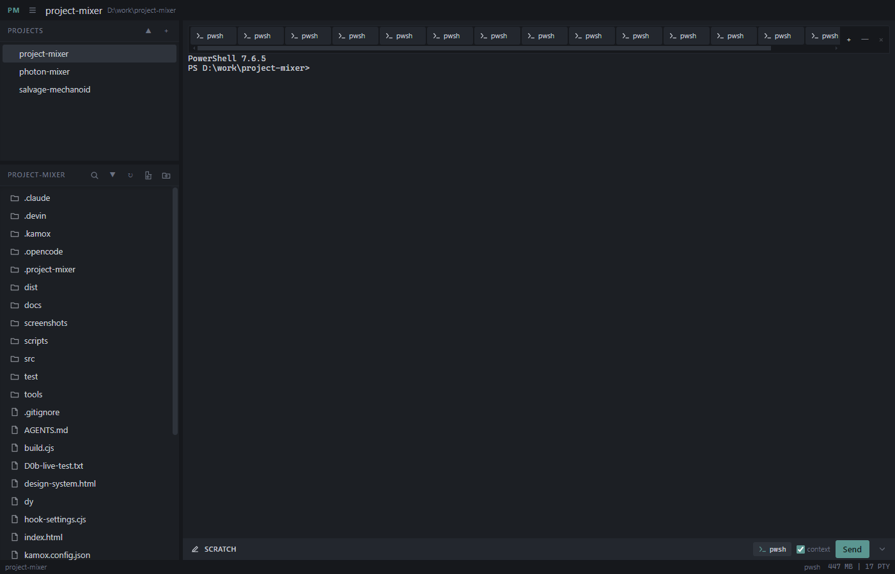
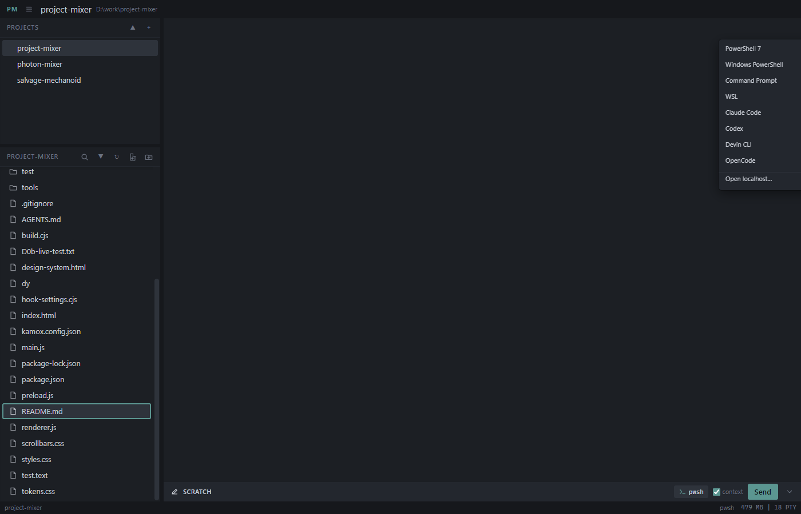
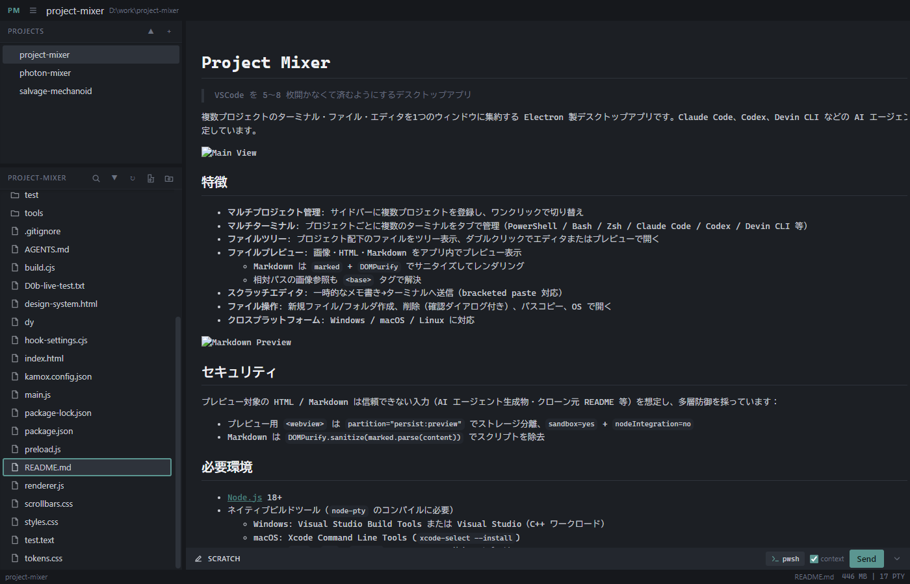

# Project Mixer

> 複数プロジェクトの AI エージェント・ターミナル・ファイルを1つのウィンドウに集約するデスクトップアプリ

Claude Code、Codex、Devin CLI、OpenCode などの AI エージェントを複数同時に走らせるワークフローを想定した Electron 製デスクトップアプリです。ターミナル・エディタ・ファイルプレビュー・ローカルブラウザを統合し、VSCode を複数枚開かなくてもプロジェクト横断の作業が完結します。



## 特徴

- **マルチプロジェクト管理**: サイドバーに複数プロジェクトを登録し、ワンクリックで切り替え。各プロジェクトのタブ・エディタ・ペイン構成は自動保存・復元
- **マルチペイン レイアウト**: メインエリアを縦横に分割し、複数のターミナル・ファイルを同時表示（最大4ペイン）。タブはペイン間ドラッグ&ドロップで移動可能
- **マルチターミナル**: プロジェクトごとに複数のターミナルをタブで管理（PowerShell / Bash / Zsh / Claude Code / Codex / Devin CLI / OpenCode 等）
- **CodeMirror 6 エディタ**: ファイル編集・スクラッチメモを CodeMirror 6 で提供。タブ切替で undo 履歴・カーソル・スクロール位置を保持
- **ファイルツリー**: プロジェクト配下のファイルをツリー表示、ダブルクリックでエディタまたはプレビューで開く
- **ファイルプレビュー**: 画像・HTML・Markdown をアプリ内でプレビュー表示
  - Markdown は `marked` + `DOMPurify` でサニタイズしてレンダリング
  - 相対パスの画像参照も `<base>` タグで解決
- **ローカルブラウザ**: `localhost` / `127.0.0.1` / `[::1]` の開発サーバーをアプリ内の webview で開く
- **スクラッチ Composer**: 画面下部に常設の編集領域。`Ctrl+Enter` でターミナルへ送信（bracketed paste 動的切り替え対応）
- **検索バー**: エディタ・プレビュー・スクラッチ共通の検索バー（CodeMirror 検索へ委譲）
- **エージェント通知**: Claude Code / Codex / OpenCode の入力待ち状態をタブのバッジで表示
- **セッション履歴**: 前回のエージェントセッションを自動復元する設定（File メニューから ask / auto 切替）
- **ファイル操作**: 新規ファイル/フォルダ作成、削除（確認ダイアログ付き）、パスコピー、OS で開く
- **クロスプラットフォーム**: Windows / macOS / Linux に対応



## セキュリティ

プレビュー対象の HTML / Markdown は信頼できない入力（AI エージェント生成物・クローン元 README 等）を想定し、多層防御を採っています：

- プレビュー用 `<webview>` は `partition="persist:preview"` でストレージ分離、`sandbox=yes` + `nodeIntegration=no`
- Markdown は `DOMPurify.sanitize(marked.parse(content))` でスクリプトを除去
- ローカルブラウザは `localhost` / `127.0.0.1` / `[::1]` のみ許可、リモートサイトは拒否

## 必要環境

- [Node.js](https://nodejs.org/) 18+
- ネイティブビルドツール（`node-pty` のコンパイルに必要）
  - Windows: Visual Studio Build Tools または Visual Studio（C++ ワークロード）
  - macOS: Xcode Command Line Tools (`xcode-select --install`)
  - Linux: `make`, `g++`, `python3` + Electron の依存ライブラリ

## セットアップ

```bash
# 依存関係をインストール
npm install

# node-pty をプラットフォーム向けにリビルド
npm run rebuild

# 起動
npm start
```

## 配布ビルド

```bash
# Windows (NSIS installer)
npm run dist:win

# Windows (portable)
npm run dist:win:portable

# macOS (dmg)
npm run dist:mac

# Linux (AppImage)
npm run dist:linux
```

ビルド成果物は `dist/` に出力されます。

## 使い方

### プロジェクト追加

サイドバーの `+` ボタンからプロジェクト名とパスを入力して追加します。

### ターミナル

- `+ Terminal` ボタンからターミナルの種類を選択して起動
- タブをドラッグで並び替え可能。ペイン間へのドラッグ&ドロップにも対応
- リサイズ時に自動でターミナルサイズを調整し、最下部にスクロール

### ペイン分割

- ペインヘッダーの `│` / `─` ボタンでペインを分割（縦横切替可能）
- `Ctrl+\` で分割、`Ctrl+Shift+\` で閉じる
- `Ctrl+1`〜`Ctrl+4` でペイン切替
- タブはペイン間でドラッグ&ドロップ移動可能

### ファイルツリー

- フォルダをクリックで展開/折りたたみ
- ファイルをダブルクリックでエディタまたはプレビューで開く（拡張子で自動判定）
- 右クリックでコンテキストメニュー: Open in Editor / Preview / Open in OS / Copy Path / Insert Path to Terminal / Insert Filename to Terminal / Delete

### エディタ

- **スクラッチ Composer**: 画面下部に常設の一時メモ領域。`Ctrl+Enter` でターミナルへ送信
- **ファイルタブ**: 既存ファイルを CodeMirror 6 で編集。`Ctrl+S` で上書き保存
- 選択範囲を `Ctrl+Shift+Enter` で `path:L10-L20` 形式でスクラッチへ挿入

### プレビュー



| 種別 | 拡張子 | 表示方法 |
|---|---|---|
| 画像 | `.png` `.jpg` `.jpeg` `.gif` `.webp` `.svg` `.bmp` `.ico` | webview に直接ロード |
| HTML | `.html` `.htm` | webview に `file://` で直接ロード |
| Markdown | `.md` `.markdown` | `marked` + `DOMPurify` でレンダリング、GitHub風ダークテーマ |

## ショートカット

| キー | 動作 |
|---|---|
| `Ctrl+S` | ファイル保存 |
| `Ctrl+Enter` | スクラッチの内容をターミナルへ送信 |
| `Ctrl+I` | スクラッチへフォーカス |
| `Ctrl+Shift+Z` | 最後に送信した内容を取り消す（スクラッチ） |
| `Ctrl+F` | 検索バーを開く（エディタ・プレビュー・スクラッチ） |
| `Ctrl+D` | 次の同じ文字列を選択に追加（エディタ・スクラッチ） |
| `Ctrl+Shift+Enter` | 選択範囲をスクラッチへ挿入（エディタ） |
| `Ctrl+B` | サイドバーの開閉 |
| `Ctrl+Shift+F` | 検索ペインを開く |
| `Ctrl+\` | ペイン分割 |
| `Ctrl+Shift+\` | ペインを閉じる |
| `Ctrl+1`〜`Ctrl+4` | ペイン切替 |
| `Ctrl+Shift+C` | ターミナル コピー |
| `Ctrl+A` | ターミナル 全選択 |

## 技術スタック

- [Electron](https://www.electronjs.org/) 31
- [xterm.js](https://xtermjs.org/) - ターミナルエミュレータ
- [node-pty](https://github.com/microsoft/node-pty) - 疑似ターミナル
- [CodeMirror 6](https://codemirror.net/) - コードエディタ
- [marked](https://marked.js.org/) - Markdown パーサ
- [DOMPurify](https://github.com/cure53/DOMPurify) - HTML サニタイザ
- [esbuild](https://esbuild.github.io/) - レンダラバンドル
- [electron-builder](https://www.electron.build/) - 配布ビルド

## ライセンス

MIT
