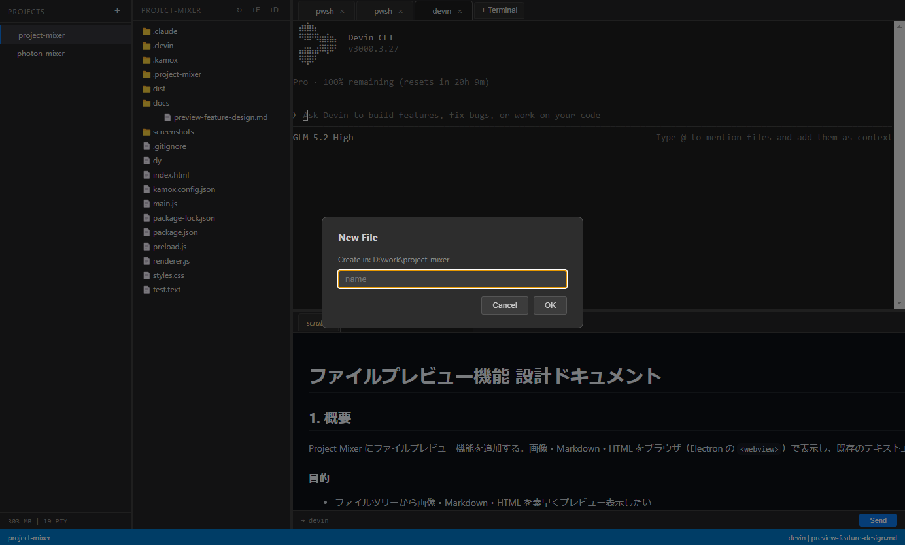

# Project Mixer

> VSCode を 5〜8 枚開かなくて済むようにするデスクトップアプリ

複数プロジェクトのターミナル・ファイル・エディタを1つのウィンドウに集約する Electron 製デスクトップアプリです。Claude Code、Codex、Devin CLI などの AI エージェントを複数同時に走らせるワークフローを想定しています。


## 特徴

- **マルチプロジェクト管理**: サイドバーに複数プロジェクトを登録し、ワンクリックで切り替え
- **マルチターミナル**: プロジェクトごとに複数のターミナルをタブで管理（PowerShell / Bash / Zsh / Claude Code / Codex / Devin CLI 等）
- **ファイルツリー**: プロジェクト配下のファイルをツリー表示、ダブルクリックでエディタまたはプレビューで開く
- **ファイルプレビュー**: 画像・HTML・Markdown をアプリ内でプレビュー表示
  - Markdown は `marked` + `DOMPurify` でサニタイズしてレンダリング
  - 相対パスの画像参照も `<base>` タグで解決
- **スクラッチエディタ**: 一時的なメモ書き→ターミナルへ送信（bracketed paste 対応）
- **ファイル操作**: 新規ファイル/フォルダ作成、削除（確認ダイアログ付き）、パスコピー、OS で開く
- **クロスプラットフォーム**: Windows / macOS / Linux に対応


## セキュリティ

プレビュー対象の HTML / Markdown は信頼できない入力（AI エージェント生成物・クローン元 README 等）を想定し、多層防御を採っています：

- プレビュー用 `<webview>` は `partition="persist:preview"` でストレージ分離、`sandbox=yes` + `nodeIntegration=no`
- Markdown は `DOMPurify.sanitize(marked.parse(content))` でスクリプトを除去

## 必要環境

- [Node.js](https://nodejs.org/) 18+
- ネイティブビルドツール（`node-pty` のコンパイルに必要）
  - Windows: Visual Studio Build Tools または Visual Studio（C++ ワークロード）
  - macOS: Xcode Command Line Tools (`xcode-select --install`)
  - Linux: `make`, `g++`, `python3` + Electron の依存ライブラリ

## セットアップ

```bash
# 依存関係をインストール
npm install

# node-pty をプラットフォーム向けにリビルド
npm run rebuild

# 起動
npm start
```

## 配布ビルド

```bash
# Windows (NSIS installer)
npm run dist:win

# Windows (portable)
npm run dist:win:portable

# macOS (dmg)
npm run dist:mac

# Linux (AppImage)
npm run dist:linux
```

ビルド成果物は `dist/` に出力されます。

## 使い方

### プロジェクト追加

サイドバーの `+` ボタンからプロジェクト名とパスを入力して追加します。

### ターミナル

- `+ Terminal` ボタンからターミナルの種類を選択して起動
- タブをドラッグで並び替え可能
- リサイズ時に自動でターミナルサイズを調整し、最下部にスクロール

### ファイルツリー

- フォルダをクリックで展開/折りたたみ
- ファイルをダブルクリックでエディタまたはプレビューで開く（拡張子で自動判定）
- 右クリックでコンテキストメニュー: Open in Editor / Preview / Open in OS / Copy Path / Insert Path to Terminal / Insert Filename to Terminal / Delete



- ツリーヘッダーのボタン: `↻` 再読み込み / `+F` 新規ファイル / `+D` 新規フォルダ

### エディタ

- **スクラッチタブ**: 一時的なメモ書き。`Ctrl+Enter` でターミナルへ送信
- **一時タブ** (`+` ボタン): `Ctrl+S` で保存ダイアログを開き、ファイルとして保存可能
- **ファイルタブ**: 既存ファイルを編集。`Ctrl+S` で上書き保存

### プレビュー

| 種別 | 拡張子 | 表示方法 |
|---|---|---|
| 画像 | `.png` `.jpg` `.jpeg` `.gif` `.webp` `.svg` `.bmp` `.ico` | webview に直接ロード |
| HTML | `.html` `.htm` | webview に `file://` で直接ロード |
| Markdown | `.md` `.markdown` | `marked` + `DOMPurify` でレンダリング、GitHub風ダークテーマ |

## ショートカット

| キー | 動作 |
|---|---|
| `Ctrl+S` | ファイル保存（一時タブの場合は保存ダイアログ） |
| `Ctrl+Enter` | エディタの内容をターミナルへ送信 |
| `Ctrl+I` | スクラッチタブへ切り替え |
| `Ctrl+Shift+Z` | 最後に送信した内容を取り消す（スクラッチタブ） |

## 技術スタック

- [Electron](https://www.electronjs.org/) 31
- [xterm.js](https://xtermjs.org/) - ターミナルエミュレータ
- [node-pty](https://github.com/microsoft/node-pty) - 疑似ターミナル
- [marked](https://marked.js.org/) - Markdown パーサ
- [DOMPurify](https://github.com/cure53/DOMPurify) - HTML サニタイザ
- [electron-builder](https://www.electron.build/) - 配布ビルド

## ライセンス

MIT
